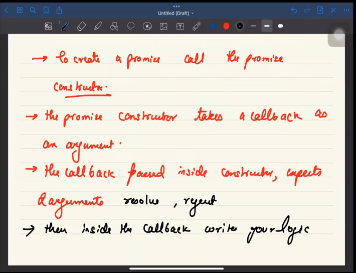
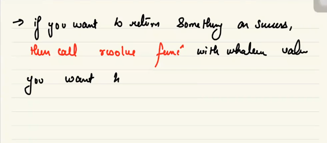

## We gonna learn is what are promises and how do we generally use them

Promises are special Javascript Object that is used as a placeholder for the eventual result of some futuristic computation  
-> How these objects are created  
-> How to consume these objects  
-> what are the properties associated

How promises work behind the scenes
Promise Object that we create has 4 major properties

## properties

-> Status 
-> Value 
-> on fulfilment 
-> on rejected 

### Status

status show current promise state 

1. Pending state \_ still going on
2. Fulfilled state \_promise is completed
3. rejected state \_error

### Value

when the status of the promise is pending, this value property is **undefined**, the moment promise is resolved the value property is updated from **undefined** to new value(this value can be considered as the new value or the resolved value) so the value property acts like placeholder in the time promise function

### onFulfillment

This is an array, which contains the functions that we attach to the promise object when the value property is updated from undefined to newValue, js gives chance to these attached functions one by one with the value property as their argument if there is no piece of code in the call stack and global code logic

## How to create and consume the promise

  

